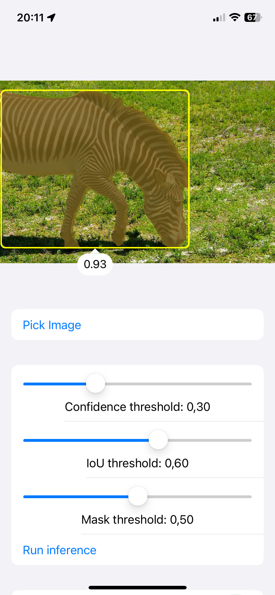

# YOLOv8-seg-iOS
YOLO11 / YOLOv8 ([Ultralytics](https://github.com/ultralytics/ultralytics)) instance segmentation on iOS using Core ML (WIP), Vision, TensorFlow Lite, PyTorch Mobile.

  

## TODO:
- Inference using Core ML

## Usage:
1. Clone repository
2. Install pods via CocoaPods
3. Add your exported YOLO11-seg or YOLOv8-seg models to the project
4. Update the file paths inside `ContentViewModel.swift` with new file names or init new Core ML model
